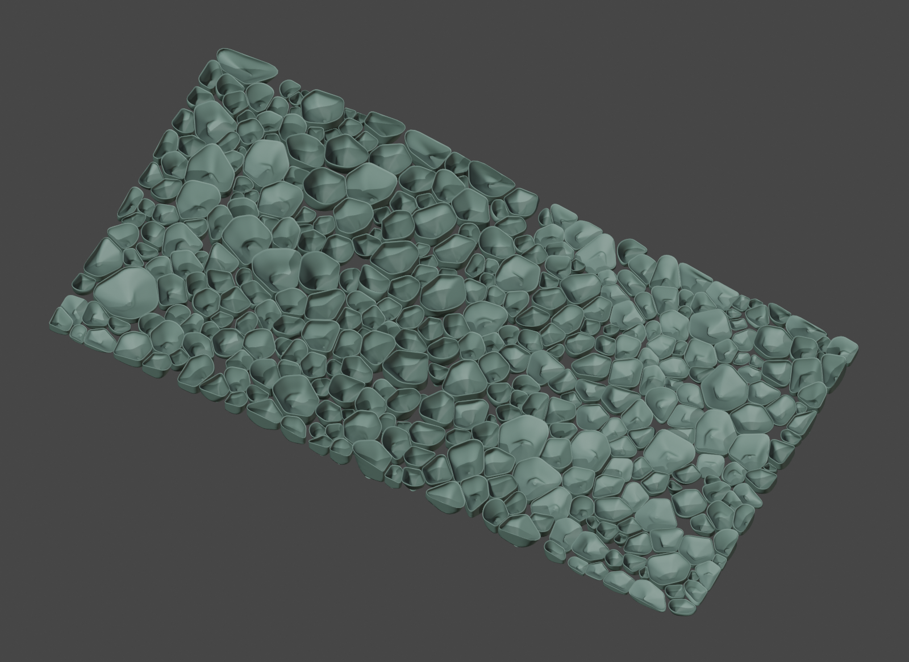

# Organic Cup Field Generator

A Blender 4.x add-on for generating large wall artworks made from tightly packed,
hollow organic cups. The forms combine tulip, calla-lily, coral, and teardrop
characteristics with a coherent height wave and downward undercurrent.

The recommended workflow generates the entire artwork as one master composition,
then assigns individually numbered glue-down pieces to A1 Mini-sized assembly
regions. This preserves the wave, clustering, orientation, and packing across the
finished work instead of restarting them at every panel boundary.

## Highlights

- Smooth hollow cups with off-center funnel throats and thin continuous rims
- Dense collision-aware packing with hero, medium, and filler forms
- Global wave, noise, clustering, curl-flow, and downward-current fields
- One-pass generation of an entire multi-panel artwork
- Numbered individual pieces with integral flat glue feet and connected geometry
- Assembly-region collections and non-rendering viewport guides
- Numbered full-scale SVG mounting maps, region sheets and CSV coordinates
- Individual STL files plus automatically spaced print plates and plate ID diagrams
- One-click full-artwork studio render, with straight-on and angled camera views
- Optional shared backing panels, rounded blocks, and mixed geometry
- Optional voxel-remeshed manifold output
- A1 Mini planning with a default 175 × 175 mm safe working footprint

## Quick start

1. Download `organic_cup_field_generator.py`.
2. In Blender 4.x, choose **Edit → Preferences → Add-ons → Install from Disk**.
3. Install and enable the add-on.
4. In the 3D View, press **N** and open **Organic Cups**.
5. Select **Modular Coral (Recommended)** and click **Apply Selected Preset**.
6. Enter the complete assembled width and height under **Finished Work / A1 Mini**.
7. Click **Generate Finished Work**.
8. Inspect the complete artwork and regenerate with a new seed if desired.
9. Use **Render All Panels** to inspect the composition.
10. Use **Export Print & Assembly Package** to save STLs, print plates and maps.

Assembly-region collections organize mounting. The export package separately
arranges print plates within the usable A1 Mini footprint, preserving each
piece's orientation and adding adjustable spacing.

## Documentation

- [Complete install, control, generation, assembly, and printing guide](README_organic_cup_field_generator.md)
- [Development journey and design rationale](DEVELOPMENT_JOURNEY.md)
- [Version history and regression checks](CHANGELOG.md)

## Reference boundary

The modular organization and overall visual target were informed by photographs
provided during development and by Paragami's public Coral Sponge examples and
numbered-layout assembly workflow. This project does not contain, trace, or
reproduce Paragami model files or proprietary block geometry. Every generated
form is produced procedurally by this add-on.

## Requirements

- Blender 4.0 or newer
- An FDM printer for physical output; defaults are designed around the Bambu Lab
  A1 Mini's 180 × 180 × 180 mm build volume

## Current version

Version 1.8.0

Run the regression test in Blender:

    blender --background --factory-startup --python-exit-code 1 --python tests/test_blender.py
